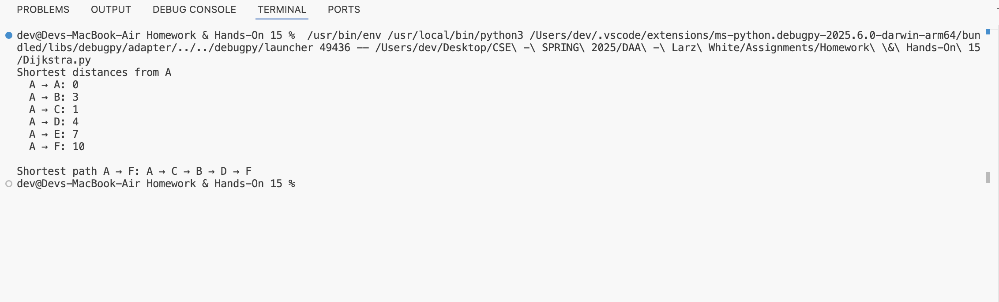
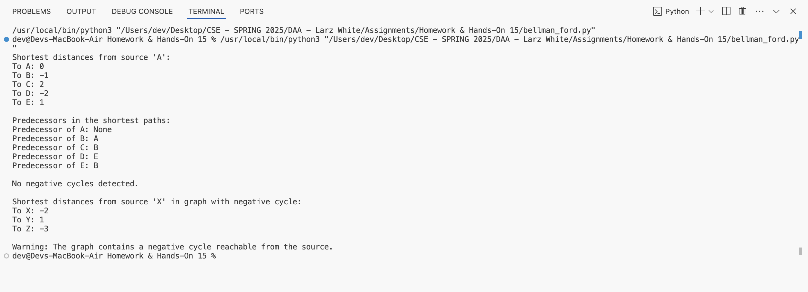
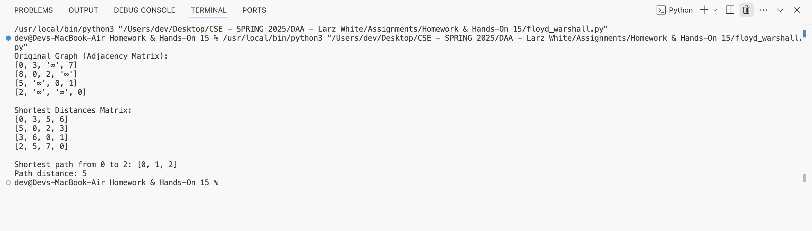

# 1002286708_DAA_Hands-On_15

# Problem 1

* Code for Dijkstra's algorithm is given [`Dijkstra.py`](Dijkstra.py)

 

 
 

# Problem 2

* Code for BellmanFord is given [`bellman_ford.py`](BellmanFord.py)

 

 
 

# Problem 3

* Code for Flyod-Warshall is given [`floyd_warshall.py`](FloydWarshall.py)

 

